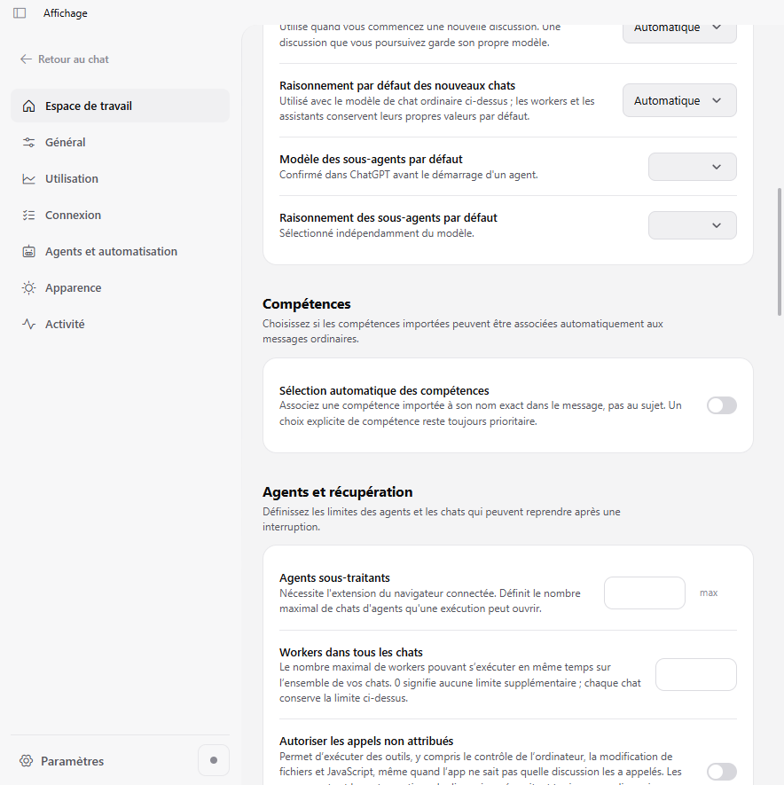
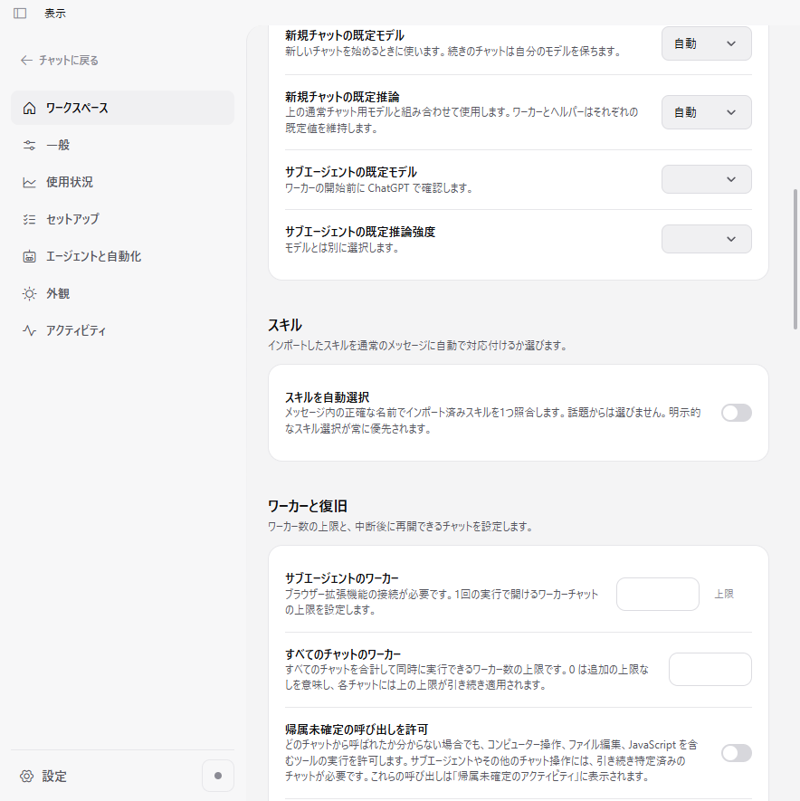
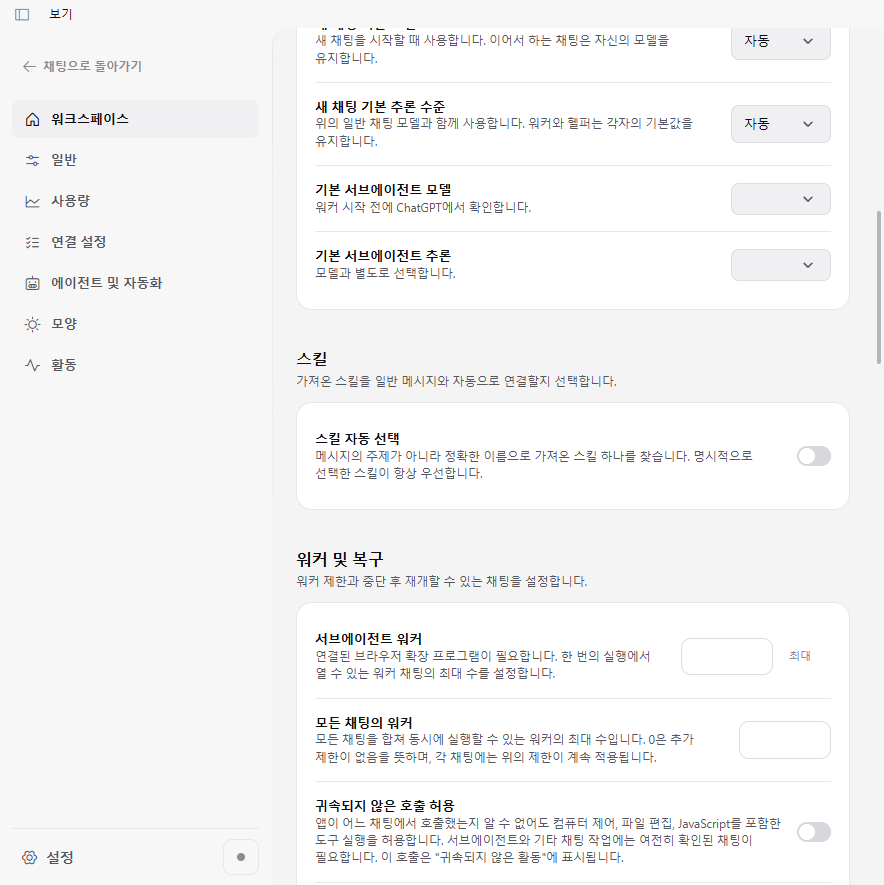
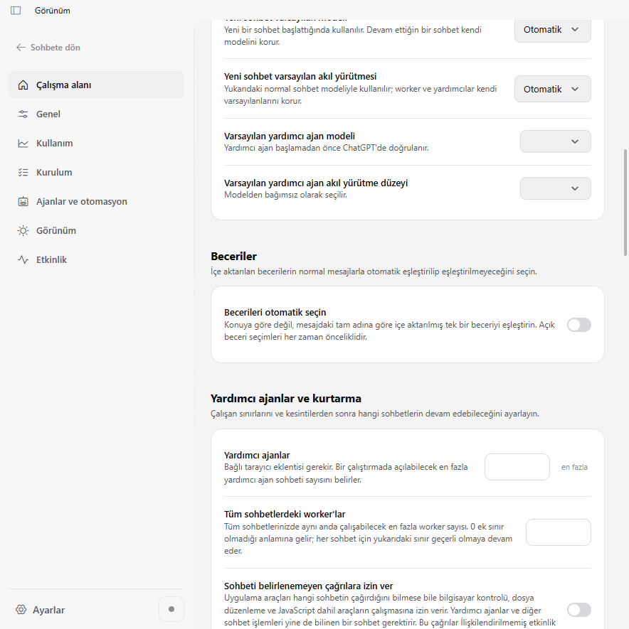
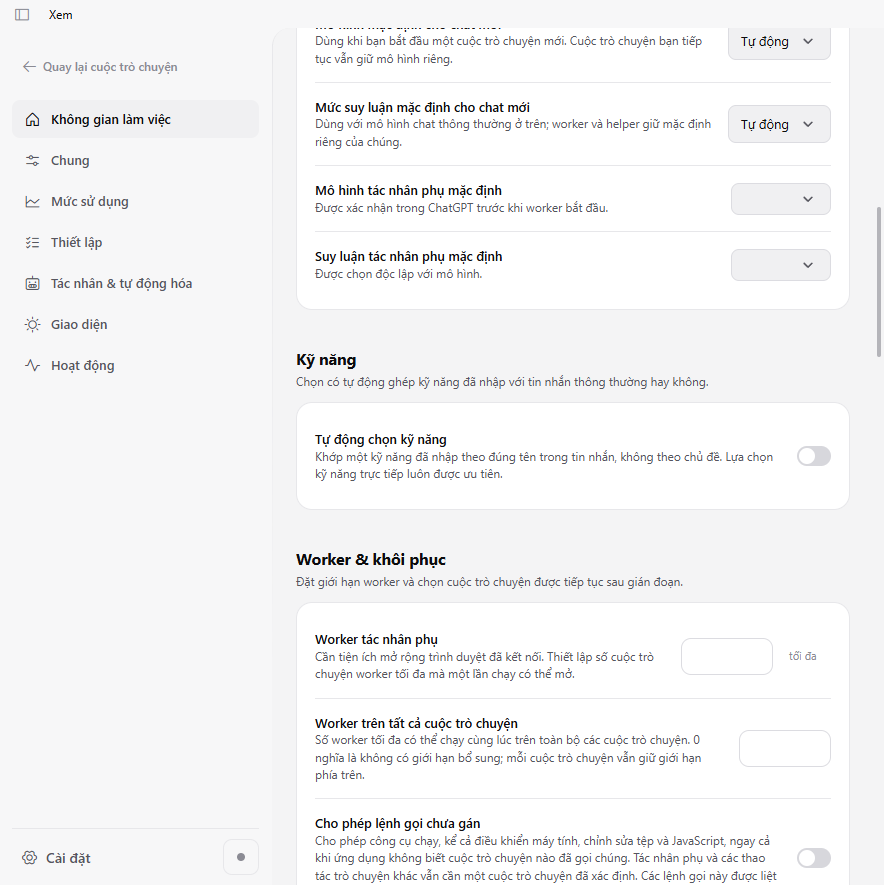
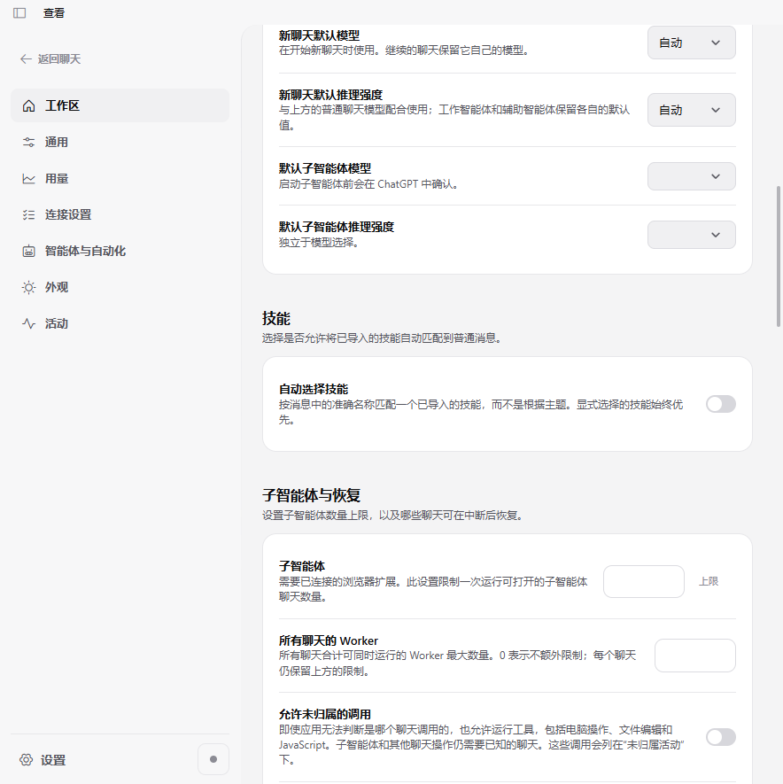
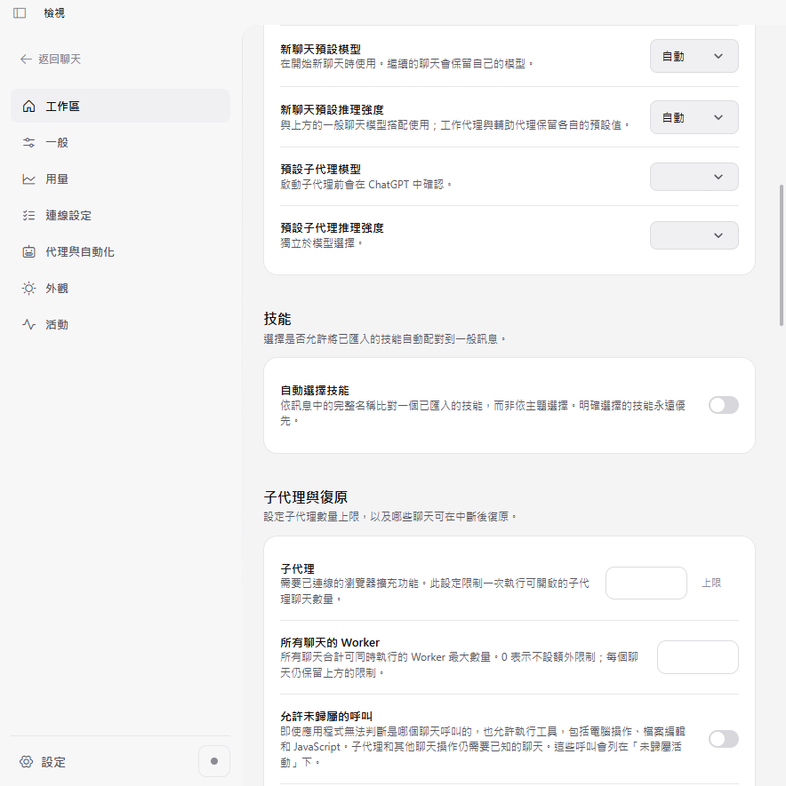

# #1022 terminology correction — 28 strings

Source revision: `1f75a81c66b6d1df687aad7bd7fd13ce84f6939a`, including main
`ac3de5fa938bf0e7718026570185093d37c6d6ea` and the terminology standard from #1057.

Seven locale regressions failed on the previous texts, then the routing/i18n batch passed
83 tests after the 28 translated values were corrected. Placeholders and source keys remain
unchanged; no matcher, policy, frozen revision or permission behavior changed.

The local Electron probe uses the actual built shell/styles and production `i18n.ts` in one
hidden owned window with isolated userData and no application backend. It checks seven
locales, two themes, two widths (900/1440), two zoom factors (100%/125%): **56 states**.
All four strings are verified against their catalog, the original switch stays off, and the
visible row must fit without overflow. The dynamic selected-name string is checked through
the real translation function, not misrepresented as a rendered chat badge.

The first diagnostic reused scroll positions across locale/zoom changes and failed viewport
assertions. The final fixture loads its inert document fresh for each state while reusing
the same window; viewport assertions were not relaxed and no production code changed.
Screenshots below are full views (not the earlier diagnostic crops), visually inspected
for all seven locales. These are layout fixtures, not installed/user/provider settings.

The JSON receipt and SHA-256 manifest accompany the images. No font files, personal data,
provider conversation content, installed settings or credentials are included.
